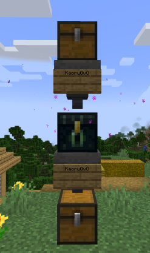

# EnderHopper

Allows hoppers to operate ender chests in Minecraft.

## Screenshot



## Usage

Place an **OAK_SIGN** on the hopper above or below the ender chest and write the name of the player who needs to be operated.

- Optional: Modify the **CACHE_EXPIRE_TICKS** constant in `EnderHopperCache.java` to extend the cache lifetime

## Build

```bash
git clone https://github.com/cstom4994/EnderHopper.git

gradlew jar
```

## Author

KaoruXun

## License

[MIT](./LICENSE)
